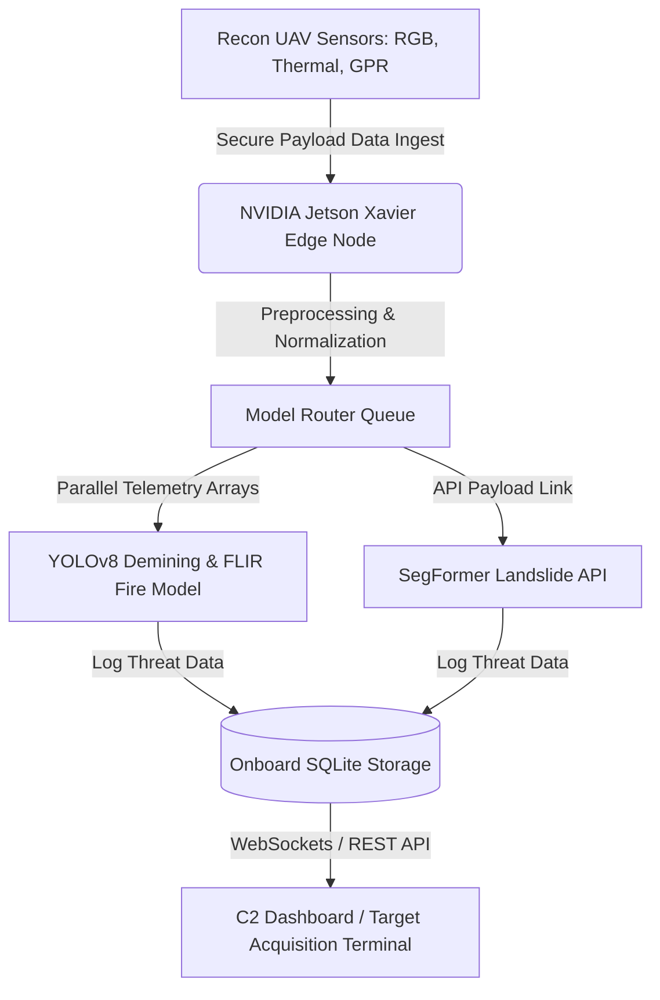

# D-MIND: Tactical Disaster & Humanitarian Intelligence Platform

D-MIND (Tactical Disaster & Humanitarian Intelligence Platform) is an AI-powered Edge UAV reconnaissance system designed to preserve civilian lives in post-conflict and active disaster zones. Deployed locally on an **NVIDIA Jetson Xavier NX**, the platform integrates multiple sensor payloads—including Optical (RGB), FLIR Thermal, and Ground Penetrating Radar (GPR)—to perform real-time autonomous threat classification, hazard zoning, and demining telemetry.

---

## 🛰️ Core Capabilities & Social Impact

*   🔥 **Thermal Hazard Containment (Wildfires):** YOLOv8-based local object detection and bounding-box segmentation to map active forest fire perimeters and calculate hazard spread severity.
*   ⛰️ **Geo-Hazard Mapping & Route Clearance (Landslides):** Integrates Roboflow's SegFormer Semantic Segmentation API to overlay landslide masks and automatically assess route blockages.
*   💣 **Demining & Subsurface UXO Detection (Landmines):** Scans thermal/GPR grayscale images to target and pinpoint buried UXO (Unexploded Ordnance) in war-torn areas for safe humanitarian corridors.
*   👤 **Search & Rescue Telemetry (Human Tracking):** Thermal-enhanced local person tracker that counts and flags survivor coordinates inside affected operational sectors.

---

## 📐 C4ISR System Architecture



---

## 📂 Repository Structure

The project is structured as a decoupled monorepo to allow for independent local development and easy cloud hosting:

```text
├── .gitignore               # Configured to ignore virtualenvs, credentials, and temp uploads
├── render.yaml              # Render blueprint for zero-config backend web service deployment
├── README.md                # System documentation
├── backend/                 # FastAPI server & AI model inference codebase
│   ├── app.py               # Main application and database orchestration
│   ├── requirements.txt     # Python dependencies (optimized headless libraries)
│   ├── .env.example         # Environment template file
│   └── static/              # Storage directories for uploaded payloads & result masks
│       ├── uploads/         # Ingested raw payloads
│       └── results/         # Annotated analytics output
└── frontend/                # Tactical Command & Control dashboard (Static HTML5/CSS3/Vanilla JS)
    ├── index.html           # Landing page with UAV schematic
    ├── detection.html       # Fullscreen target acquisition terminal (NVD views)
    ├── dashboard.html       # Command & Control analytics dashboard (Live radar feeds)
    └── vercel.json          # Vercel configuration for API proxy routing
```

---

## ⚡ Local Setup

### 1. Backend Server Setup
Make sure you have **Python 3.10+** installed.

1. Navigate into the `backend/` directory:
   ```bash
   cd backend
   ```
2. Create and activate a Python virtual environment:
   ```bash
   python -m venv .venv
   # On Windows:
   .venv\Scripts\activate
   # On macOS/Linux:
   source .venv/bin/activate
   ```
3. Install the required dependencies (includes headless libraries for server compatibility):
   ```bash
   pip install -r requirements.txt
   ```
4. Create a `.env` file from the example template:
   ```bash
   copy .env.example .env   # On Windows
   cp .env.example .env     # On macOS/Linux
   ```
5. Open `.env` and fill in your Roboflow workspace credentials:
   ```env
   ROBOFLOW_API_KEY=your_private_api_key_here
   ROBOFLOW_WORKSPACE=ieees-workspace-lez6m
   ROBOFLOW_WORKFLOW_ID=landslide-segmentation-api-1783455950308
   ```
6. Start the local server:
   ```bash
   python app.py
   ```
   *The server will initialize SQLite database tables (`mission.db`), load weights, and start on `http://127.0.0.1:8000` (auto-binding to the port).*

### 2. Frontend Launch
You can serve the `frontend/` folder using any static HTTP server (like VS Code Live Server or python's `http.server`), or simply double-click [`frontend/index.html`](frontend/index.html) to open the tactical interface locally in your web browser.

---

## 🌐 Deployment Instructions

### Backend (Render)
1. Commit the monorepo to **GitHub**.
2. Go to **Render Dashboard** -> **New** -> **Blueprint**.
3. Link your monorepo. Render will automatically parse [`render.yaml`](render.yaml) from the root.
4. Render will configure the Python web service inside `backend/`, install packages, assign dynamic port bindings via `$PORT`, and run `uvicorn app:app`.
5. Enter your `ROBOFLOW_API_KEY` when prompted during the blueprint build.

### Frontend (Vercel)
1. Import the same GitHub repo into **Vercel**.
2. Under **Project Settings**, change the **Root Directory** from `/` to `frontend`.
3. Vercel will read [`vercel.json`](frontend/vercel.json) from the subfolder and host the interface as a static website, proxying `/api/*` endpoints to your Render backend to bypass CORS blocks.

*Note: If you wish to connect directly to Render bypassing the Vercel proxy, copy your live Render URL and paste it into the `const BACKEND_URL = '';` variable at the top of the script tag in `detection.html` and `dashboard.html`.*

---

## 📡 API Reference Contracts

### 1. Ingest Payload Scans
*   `POST /api/detection/image` - Ingests a raw image file.
    *   **Payload (Multipart):** `file: UploadFile`
    *   **Response (JSON):**
        ```json
        {
          "result_url": "/static/results/processed_filename.jpg",
          "original_url": "/static/uploads/filename.jpg",
          "status_text": "HUMAN x3 | FIRE MODERATE DETECTED",
          "detections": [{"type": "HUMAN", "severity": "x3"}, {"type": "FIRE", "severity": "MODERATE"}]
        }
        ```

*   `POST /api/detection/video` - Ingests a raw video file.
    *   **Payload (Multipart):** `video: UploadFile`
    *   **Response (JSON):** Returns video results URLs, frame count metrics, and event log items.

### 2. C2 Dashboard Telemetry Data
*   `GET /api/stats` - Returns unified stats representing overall metrics.
*   `GET /api/missions` - Returns recent UAV sortie history records.
*   `GET /api/events?limit=50` - Returns a chronologically sorted log of individual threat logs.

---

## 👥 Operational Team

*   **Ushnish Ghosal** — AI / ML & Edge System Architect Payload Lead (AI model training, sensor routing pipelines, backend telemetry engine).
*   **Keshav Gupta** — Humanitarian Command & Control Interface Lead (HUD terminals, visual telemetry logs, documentation & compliance assets).
